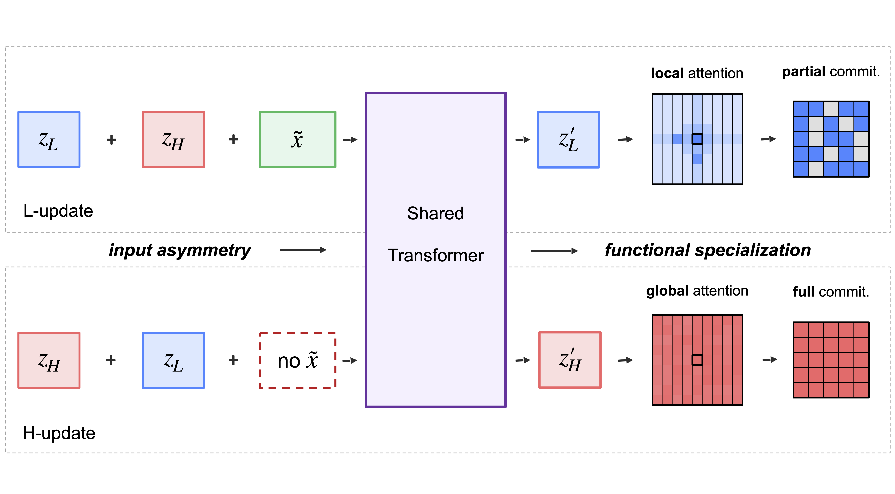

<p align="center">
  <h1 align="center">AIR — Asymmetric Input Recurrence</h1>
  <p align="center">
    <strong>One model, two roles: emergent specialization in a shared recurrent Transformer</strong>
  </p>
  <p align="center">
    <a href="https://arxiv.org/abs/2605.17811"></a>
    <a href="https://akyrillidis.github.io/aiowls/asymmetric_input.html"></a>
    <a href="https://www.python.org/"></a>
    <a href="https://pytorch.org/"></a>
    <a href="https://developer.nvidia.com/cuda-toolkit"></a>
    <a href="./LICENSE"></a>
  </p>
</p>

---

> **"One Model, Two Roles: Emergent Specialization in a Shared Recurrent Transformer"**<br>
> *[Jucheng Shen](https://juchengshen.github.io/)\*, [Wenyi Su](https://www.linkedin.com/in/barbara-su-966314268/)\*, [Anastasios Kyrillidis](https://akyrillidis.github.io/about/)*<br>
> [arXiv:2605.17811](https://arxiv.org/abs/2605.17811)

Can a shared-weight recurrent Transformer develop **two distinct internal roles** without being partitioned into separate modules? AIR (Asymmetric Input Recurrence) is a minimal two-state reasoning architecture in which the **same** Transformer block is reused for both updates, and the only built-in asymmetry is that the encoded input is injected during L-updates but not H-updates:

$$
\textbf{L-update:}\ \ \mathbf{z}_L \leftarrow f\big(\mathbf{z}_L + \mathbf{z}_H + \tilde{\mathbf{x}};\,\theta\big), \qquad
\textbf{H-update:}\ \ \mathbf{z}_H \leftarrow f\big(\mathbf{z}_H + \mathbf{z}_L;\,\theta\big).
$$

Across Sudoku-Extreme and Maze-30×30, this single architectural detail causes the shared model to specialize: $\mathbf{z}_H$ behaves like a fully-committed proposal state while $\mathbf{z}_L$ acts as a shifting scratchpad. With **half** the Transformer parameters of the two-network HRM baseline, AIR **matches or exceeds** its accuracy on both tasks.

<div align="center">
  
</div>

## ✨ Key Features

- **Shared parameters, distinct roles** — one Transformer block, two latent states with mechanistically-different functional roles
- **Half the parameters of HRM** — matches the two-network baseline (Wang et al. 2025) on Sudoku (60.0% vs 55.0%) and Maze (75.6% vs 74.5%)
- **Asymmetric input is the necessary signal** — symmetric variants collapse to ~52% Sudoku / ~70% Maze; the 8-point gap on Sudoku is the cost of removing the asymmetry
- **Prepend-and-strip level token recovers most of the gap** — adding a structurally separable state-identity token to the symmetric base lifts Sudoku from 50.9% → 57.5%
- **Mechanistic split in attention** — L-updates concentrate ~47% more attention mass inside the constraint neighbourhood than H-updates at the deepest layer; on Sudoku, deeper layers additionally route attention to violated cells
- **State coupling, not redundancy** — freeze experiments collapse final accuracy to 0% on both tasks; the two states are load-bearing in a coupled feedback loop
- **Open-source reproduction** — every figure, table, and ablation in the paper has a corresponding shell script under `experiment_*/`

## 🚀 Quick Start

### Prerequisites

Python 3.10+. Install Python dependencies:

```bash
pip install -r requirements.txt
unzip adam_atan2.zip          # bundles the AdamATan2 optimizer
```

If CUDA 12.6 and matching PyTorch wheels are not already installed, one tested setup is:

```bash
# CUDA 12.6
CUDA_URL=https://developer.download.nvidia.com/compute/cuda/12.6.3/local_installers/cuda_12.6.3_560.35.05_linux.run
wget -O cuda_installer.run "$CUDA_URL"
sudo sh cuda_installer.run --silent --toolkit --override
export CUDA_HOME=/usr/local/cuda-12.6

# PyTorch with CUDA 12.6
pip install torch torchvision torchaudio --index-url https://download.pytorch.org/whl/cu126

# Build helpers for the CUDA extensions
pip install packaging ninja wheel setuptools setuptools-scm
```

Training scripts log to [Weights & Biases](https://wandb.ai/):

```bash
export WANDB_API_KEY=your_wandb_api_key
```

### Build the datasets

```bash
python dataset/build_sudoku_dataset.py \
  --output-dir data/sudoku-extreme-1k-aug-1000 \
  --subsample-size 1000 --num-aug 1000

python dataset/build_maze_dataset.py \
  --output-dir data/maze-30x30-hard-1k
```

If you already have prebuilt datasets, place them at `data/sudoku-extreme-1k-aug-1000` and `data/maze-30x30-hard-1k`.

### Train the default AIR variant (Lx_H, the canonical $(n_L, n_H) = (1, 0)$ asymmetric model)

```bash
# Sudoku-Extreme
bash experiment_input-injection-specialization-sudoku/train_sudoku_Lx_H.sh

# Maze-30×30
bash experiment_input-injection-specialization-maze/train_maze_Lx_H.sh
```

### Reproduce the full injection-asymmetry ablation (all 8 variants × 5 seeds)

```bash
bash experiment_input-injection-specialization-sudoku/run_all_input_injection_specialization.sh
bash experiment_input-injection-specialization-maze/run_all_input_injection_specialization.sh
```

If you are not on a Slurm cluster, run individual `train_*.sh` scripts directly (each is a single-GPU launch). Variant naming follows the paper: `L_Hx`, `Lx_H`, `L_H2x`, `L2x_H`, `Lx_H2x`, `L2x_Hx`, `Lx_Hx`, `L2x_H2x`.

### Level-token control (Section 4 of the paper)

```bash
bash experiment_addition-prepend-strip-no-strip/run_all_addition_prepend_strip_no_strip.sh
```

### Operator-form control (Appendix)

```bash
bash experiment_operator-form-control/run_all_operator_form_control.sh
```

## 📁 Repository Structure

```
├── pretrain.py                                # Training entry point (Hydra-configured)
├── evaluate.py                                # Held-out evaluation
├── puzzle_dataset.py                          # Puzzle-token dataset wrapper
├── config/                                    # Default architecture + training configs
├── dataset/                                   # Sudoku-Extreme + Maze-30×30 builders
├── models/
│   └── air/                                   # AIR architecture variants (shared block, two states)
├── experiment_input-injection-specialization-sudoku/  # 8 AIR variants × 5 seeds on Sudoku
├── experiment_input-injection-specialization-maze/    # 8 AIR variants × 5 seeds on Maze
├── experiment_addition-prepend-strip-no-strip/        # Level-token controls (addition / prepend-strip / prepend-no-strip)
├── experiment_operator-form-control/                  # Linear, nonlinear, Hadamard, sign-flip input transforms
├── experiment_visual-sudoku-decoded-freeze/           # Decoded zH/zL rollouts + freeze interventions (Sudoku)
├── experiment_visual-maze-decoded-freeze/             # Decoded zH/zL rollouts + freeze interventions (Maze)
├── experiment_attention-analysis-sudoku/              # Attention contrasts (bar charts + example heatmaps)
├── experiment_attention-analysis-maze/                # Maze counterpart
├── adam_atan2.zip                             # Bundled AdamATan2 optimizer; unzip before training
└── requirements.txt
```

Each experiment folder ships **precomputed `example_*` outputs** so the figures in the paper can be regenerated from cached intermediate data without retraining.

## 💻 Hardware

| Hardware | Use | Notes |
|----------|-----|-------|
| 1 × NVIDIA H200 (80 GB) | Single Sudoku training run | ~4 hours per run |
| 8 × NVIDIA H200 (80 GB) | Single Maze training run | ~3 hours per run |
| Any Ampere or newer GPU | Inference / freeze / attention analysis | ≤ 16 GB sufficient for batched eval |

Total compute reported in the paper (all sweeps + preliminary runs): ~500 GPU-hours.

## 📊 Results Highlights

### Injection-asymmetry ablation — asymmetric matches the two-network baseline at half the parameters

All numbers are mean ± standard deviation across 5 training seeds, evaluated on the full held-out test sets (422,786 Sudoku puzzles, 1,000 mazes). **Bold** marks the per-column winner.

| Variant | $(n_L, n_H)$ | $\Delta$ | Sudoku (%) | Maze (%) |
|---------|:---:|:---:|:---:|:---:|
| *Asymmetric ($\Delta > 0$)* | | | | |
| L_Hx | (0, 1) | 1 | 58.7 ± 3.3 | 75.3 ± 3.2 |
| **Lx_H** *(default)* | (1, 0) | 1 | **60.0 ± 2.0** | 71.0 ± 6.3 |
| L_H2x | (0, 2) | 2 | 58.6 ± 1.9 | **75.6 ± 1.9** |
| L2x_H | (2, 0) | 2 | 59.1 ± 2.4 | 71.1 ± 6.4 |
| Lx_H2x | (1, 2) | 1 | 59.6 ± 0.9 | 70.9 ± 2.4 |
| L2x_Hx | (2, 1) | 1 | 58.6 ± 2.9 | 74.5 ± 1.6 |
| *Group mean (asym)* | — | — | *59.1* | *73.1* |
| *Symmetric ($\Delta = 0$)* | | | | |
| Lx_Hx | (1, 1) | 0 | 52.1 ± 1.6 | 69.4 ± 2.5 |
| L2x_H2x | (2, 2) | 0 | 50.9 ± 2.9 | 70.3 ± 4.2 |
| *Group mean (sym)* | — | — | *51.5* | *69.9* |
| *Two-network baseline* | | | | |
| HRM (Wang et al. 2025) | — | — | 55.0 | 74.5 |

**Headline:** the asymmetric group averages ~7.6 points higher than the symmetric group on Sudoku and ~3.2 points higher on Maze, and the best AIR variants match or exceed HRM with half the Transformer parameters.

### Level-token control — a structurally separable state-identity signal recovers most of the gap

| Level-token strategy | Mechanism | Sudoku (%) |
|---|---|:---:|
| L2x_H2x (symmetric base, no token) | — | 50.9 ± 2.9 |
| &nbsp; + Addition | element-wise add to every token | 50.0 ± 1.9 |
| &nbsp; + **Prepend (strip)** | prepend, attend, then strip | **57.5 ± 1.3** |
| &nbsp; + Prepend (no strip) | prepend, persist across cycles | 47.8 ± 1.6 |
| *For reference:* asymmetric $\Delta = 1$ | — | *~59.0* |

A level token that occupies its own sequence position (prepend + strip) recovers most of the asymmetric-injection benefit. Mixing the signal into every content token (addition) or letting it accumulate content (no strip) does not work.

### Mechanistic split in attention — L is consistently more local than H

| Layer | $\Delta_{\mathrm{nbr}}$ (control) | $\Delta_{\mathrm{ent}}$ (control) | $\Delta_{\mathrm{viol}}$ (violation-adj.) |
|:---:|:---:|:---:|:---:|
| 0 | 0.050 ± 0.001 | 0.053 ± 0.000 | −0.018 ± 0.002 |
| 1 | 0.015 ± 0.001 | 0.023 ± 0.000 | 0.006 ± 0.001 |
| 2 | 0.138 ± 0.001 | 0.125 ± 0.001 | 0.028 ± 0.001 |
| 3 | 0.244 ± 0.002 | 0.182 ± 0.002 | 0.037 ± 0.002 |

L-updates put **~47% more attention mass** inside the constraint neighbourhood than H-updates at the deepest layer (Sudoku, control queries). Violation-specific routing emerges only in the deeper layers.

### Freeze interventions — both states are load-bearing

| Task | Intervention | Total content change | Final accuracy |
|---|---|:---:|:---:|
| Sudoku | normal | $\mathbf{z}_L$: 1,235 / $\mathbf{z}_H$: 275 | 55.1% |
| Sudoku | freeze $\mathbf{z}_H$ → measure $\mathbf{z}_L$ | $\mathbf{z}_L$: 323 (↓) | 0% |
| Sudoku | freeze $\mathbf{z}_L$ → measure $\mathbf{z}_H$ | $\mathbf{z}_H$: 551 (↑) | 0% |
| Maze | normal | $\mathbf{z}_L$: 1,290 / $\mathbf{z}_H$: 825 | 71.0% |
| Maze | freeze $\mathbf{z}_H$ → measure $\mathbf{z}_L$ | $\mathbf{z}_L$: 2,305 (↑) | 0% |
| Maze | freeze $\mathbf{z}_L$ → measure $\mathbf{z}_H$ | $\mathbf{z}_H$: 2,880 (↑) | 0% |

## 🔬 Reproducing the headline tables

The experiment folders ship `run_all_*.sh` scripts that submit the full sweep via `sbatch`. To run a single variant directly:

```bash
# Sudoku — default AIR
bash experiment_input-injection-specialization-sudoku/train_sudoku_Lx_H.sh

# Sudoku — symmetric control
bash experiment_input-injection-specialization-sudoku/train_sudoku_Lx_Hx.sh

# Level-token (prepend-and-strip) on the symmetric base
bash experiment_addition-prepend-strip-no-strip/train_sudoku_L2x_H2x_input_token_prepend.sh
```

### Visual decoded-state and freeze experiments

Both `experiment_visual-*-decoded-freeze/` folders contain `decode_*_intermediate_first_10.sh`, `*_freeze_zH_zL_*5runs.sh`, and `*_freeze_zH_zL_symmetric.sh`. These require trained checkpoints; by default they look under `checkpoints/` paths configured in each script. Override via `AIR_SUDOKU_CKPT_PATH` / `AIR_MAZE_CKPT_PATH`, or edit the path at the top of the script.

Precomputed `example_*` outputs ship with each folder so the four-panel decoded figures and freeze plots can be regenerated without retraining.

### Attention analysis

```bash
# Bar-chart data + multi-layer figure
bash experiment_attention-analysis-sudoku/generate_bar_data.sh
bash experiment_attention-analysis-sudoku/multilayer_figure.sh

# Single-puzzle example heatmaps (uses bundled example_data/)
bash experiment_attention-analysis-sudoku/render_example.sh

# Maze counterparts
bash experiment_attention-analysis-maze/generate_bar_data.sh
bash experiment_attention-analysis-maze/multilayer_figure.sh
bash experiment_attention-analysis-maze/render_example.sh
```

`generate_bar_data.py` captures L/H attention maps over 1,000 test puzzles at sub-steps {2, 4, 6, 8, 10, 12, 14, 15} and writes per-layer JSON into `bar_data/`. `render_example.py` reads the included `example_data/*.npz` and `*_index.json` to recreate the core-comparison and temporal-evolution heatmaps shown in the blog post.

## 📝 Citation

```bibtex
@article{shen2026air,
  title   = {One Model, Two Roles: Emergent Specialization in a Shared Recurrent Transformer},
  author  = {Shen, Jucheng and Su, Wenyi and Kyrillidis, Anastasios},
  journal = {arXiv preprint arXiv:2605.17811},
  year    = {2026},
  url     = {https://arxiv.org/abs/2605.17811}
}
```

## 📖 Blog Post

- 🧠 [**One Model, Two Roles**](https://akyrillidis.github.io/aiowls/asymmetric_input.html) — Quanta-style walkthrough on AI-OWLS. Decoded rollouts, the symmetric control, the injection-asymmetry ablation, the level-token recovery, the freeze experiments, and the attention split — for a reader outside the subfield.

## 👥 Authors

- [Jucheng Shen](https://juchengshen.github.io/) — `jucheng.shen@rice.edu`
- [Wenyi (Barbara) Su](https://www.linkedin.com/in/barbara-su-966314268/) — `barbara.su@rice.edu`
- [Anastasios Kyrillidis](https://akyrillidis.github.io/about/) — `anastasios@rice.edu`

**Rice University**, Department of Computer Science.
Jucheng Shen and Wenyi (Barbara) Su contributed equally.

## 📄 License

[Apache License 2.0](./LICENSE).
